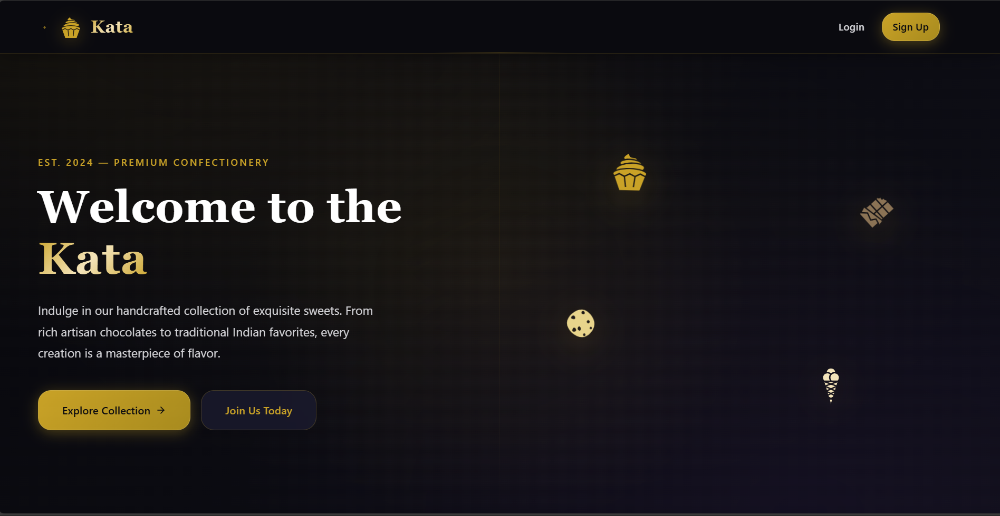
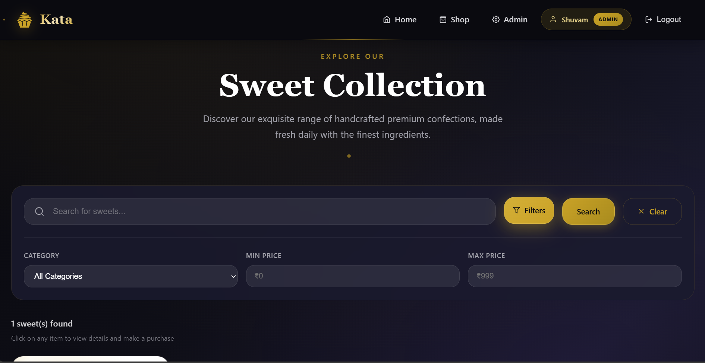
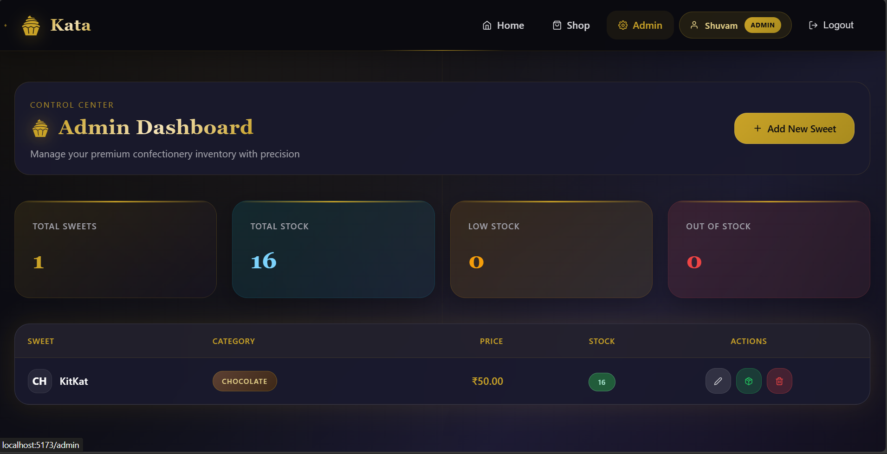

# 🍬 Kata Management System

A full-stack Kata Management System built with Node.js/Express/TypeScript backend and React/Vite frontend. This application allows users to browse, search, and purchase sweets, while admins can manage inventory.


## 📋 Table of Contents

- [Features](#-features)
- [Tech Stack](#-tech-stack)
- [Project Structure](#-project-structure)
- [Getting Started](#-getting-started)
- [API Documentation](#-api-documentation)
- [Running Tests](#-running-tests)
- [Screenshots](#-screenshots)
- [My AI Usage](#-my-ai-usage)
- [License](#-license)

## ✨ Features

### User Features
- 👤 User registration and login with JWT authentication
- 🔍 Search and filter sweets by name, category, and price range
- 🛒 Purchase sweets (with stock validation)
- 📱 Responsive design for all devices

### Admin Features
- ➕ Add new sweets to the inventory
- ✏️ Edit sweet details (name, price, description, etc.)
- 🗑️ Delete sweets from the inventory
- 📦 Restock sweets (increase quantity)
- 📊 Admin dashboard with inventory statistics

### Sweet Categories
- 🍫 Chocolate
- 🍬 Candy
- 🎂 Cake
- 🍪 Cookie
- 🥐 Pastry
- 🍦 Ice Cream
- 🍯 Traditional
- 🍭 Other

## 🛠 Tech Stack

### Backend
- **Runtime**: Node.js
- **Framework**: Express.js
- **Language**: TypeScript
- **Database**: MongoDB with Mongoose ODM
- **Authentication**: JWT (JSON Web Tokens)
- **Password Hashing**: bcryptjs
- **Validation**: express-validator
- **Testing**: Jest + Supertest

### Frontend
- **Framework**: React 18
- **Build Tool**: Vite
- **Language**: TypeScript
- **Styling**: Tailwind CSS
- **Routing**: React Router v6
- **HTTP Client**: Axios
- **Notifications**: React Hot Toast
- **Icons**: React Icons

## 📁 Project Structure

```
sweet-shop/
├── backend/
│   ├── src/
│   │   ├── config/          # Configuration files
│   │   ├── controllers/     # Request handlers
│   │   ├── middleware/      # Custom middleware
│   │   ├── models/          # Mongoose models
│   │   ├── routes/          # API routes
│   │   ├── services/        # Business logic
│   │   ├── tests/           # Test files
│   │   ├── app.ts           # Express app setup
│   │   └── server.ts        # Server entry point
│   ├── package.json
│   └── tsconfig.json
├── frontend/
│   ├── src/
│   │   ├── components/      # Reusable UI components
│   │   ├── context/         # React context providers
│   │   ├── pages/           # Page components
│   │   ├── services/        # API service functions
│   │   ├── types/           # TypeScript types
│   │   ├── App.tsx          # Main app component
│   │   └── main.tsx         # Entry point
│   ├── package.json
│   └── vite.config.ts
├── Instructions.txt
└── README.md
```

## 🚀 Getting Started

### Prerequisites

- Node.js (v18 or higher)
- npm or yarn
- MongoDB (local installation or MongoDB Atlas)

### Installation

1. **Clone the repository**
   ```bash
   git clone <repository-url>
   cd sweet-shop
   ```

2. **Install backend dependencies**
   ```bash
   cd backend
   npm install
   ```

3. **Set up backend environment variables**
   ```bash
   # Copy the example env file
   cp .env.example .env
   
   # Edit .env with your settings
   # Required variables:
   # - MONGODB_URI: Your MongoDB connection string
   # - JWT_SECRET: A secure secret key for JWT
   ```

4. **Install frontend dependencies**
   ```bash
   cd ../frontend
   npm install
   ```

### Running the Application

1. **Start MongoDB**
   - Make sure MongoDB is running locally or use MongoDB Atlas

2. **Start the backend server**
   ```bash
   cd backend
   npm run dev
   ```
   The API will be available at `http://localhost:5000`

3. **Start the frontend development server**
   ```bash
   cd frontend
   npm run dev
   ```
   The app will be available at `http://localhost:5173`

### Production Build

**Backend:**
```bash
cd backend
npm run build
npm start
```

**Frontend:**
```bash
cd frontend
npm run build
npm run preview
```

## 📚 API Documentation

### Authentication Endpoints

| Method | Endpoint | Description | Auth Required |
|--------|----------|-------------|---------------|
| POST | `/api/auth/register` | Register a new user | No |
| POST | `/api/auth/login` | Login user | No |
| GET | `/api/auth/me` | Get current user | Yes |

### Sweet Endpoints

| Method | Endpoint | Description | Auth Required | Admin Only |
|--------|----------|-------------|---------------|------------|
| GET | `/api/sweets` | Get all sweets | Yes | No |
| GET | `/api/sweets/search` | Search sweets | Yes | No |
| GET | `/api/sweets/:id` | Get sweet by ID | Yes | No |
| POST | `/api/sweets` | Create new sweet | Yes | Yes |
| PUT | `/api/sweets/:id` | Update sweet | Yes | Yes |
| DELETE | `/api/sweets/:id` | Delete sweet | Yes | Yes |
| POST | `/api/sweets/:id/purchase` | Purchase sweet | Yes | No |
| POST | `/api/sweets/:id/restock` | Restock sweet | Yes | Yes |

### Request/Response Examples

**Register User:**
```json
// POST /api/auth/register
{
  "name": "John Doe",
  "email": "john@example.com",
  "password": "password123",
  "role": "user" // or "admin"
}
```

**Create Sweet:**
```json
// POST /api/sweets
{
  "name": "Chocolate Truffle",
  "category": "chocolate",
  "price": 5.99,
  "quantity": 100,
  "description": "Rich chocolate truffle"
}
```

## 🧪 Running Tests

The project uses Jest for testing. Tests are located in the `backend/src/tests` directory.

```bash
cd backend

# Run all tests
npm test

# Run tests in watch mode
npm run test:watch
```

### Test Coverage

The test suite covers:
- ✅ User registration and login
- ✅ Authentication middleware
- ✅ CRUD operations for sweets
- ✅ Admin authorization
- ✅ Purchase functionality
- ✅ Restock functionality
- ✅ Input validation
- ✅ Error handling

## 📸 Screenshots

### Home Page
- Home Page: 

### Shop Page
- Dashboard view: 


### Admin Dashboard
- Admin console: 

*Replace these placeholder images with actual screenshots of your application*

## 🤖 My AI Usage

This project was developed with the assistance of AI tools, following transparent and responsible AI usage practices.

### Tools Used

- **GitHub Copilot / Claude (Anthropic)**: Used as a pair programming assistant throughout development

### How AI Was Used

1. **Project Structure & Boilerplate**
   - Generated initial project setup including folder structure, TypeScript configuration, and package.json files
   - Created boilerplate for Express server, middleware, and route handlers

2. **Model Definitions**
   - Assisted in designing Mongoose schemas for User and Sweet models
   - Helped implement password hashing and comparison methods

3. **API Development**
   - Generated controller and service layer code structure
   - Helped implement JWT authentication middleware
   - Assisted with input validation using express-validator

4. **Test Writing**
   - Generated comprehensive test suites for authentication and sweet endpoints
   - Helped set up Jest configuration and test utilities

5. **Frontend Development**
   - Created React component structures and styling with Tailwind CSS
   - Implemented React Router configuration
   - Generated context providers for state management
   - Designed responsive UI components

6. **Documentation**
   - Helped create this comprehensive README file
   - Generated API documentation examples

### Reflection on AI Impact

Working with AI significantly accelerated the development process:

- **Productivity Boost**: Reduced boilerplate writing time by approximately 60%
- **Code Quality**: AI suggestions often included best practices I might have overlooked
- **Learning**: Exposed me to new patterns and approaches in TypeScript and React
- **Debugging**: Helpful in identifying potential issues before they occurred

However, AI assistance required:
- **Critical Review**: Every suggestion was reviewed and modified as needed
- **Context Setting**: Clear prompts were necessary for useful outputs
- **Manual Testing**: All AI-generated code was thoroughly tested
- **Business Logic**: Core application logic required human understanding

The AI served as an intelligent assistant, but final decisions and quality assurance remained my responsibility.

## 📄 License

This project is licensed under the MIT License - see the LICENSE file for details.

---

Made with ❤️ and lots of 🍬

**Co-authored-by: GitHub Copilot <copilot@github.com>**
